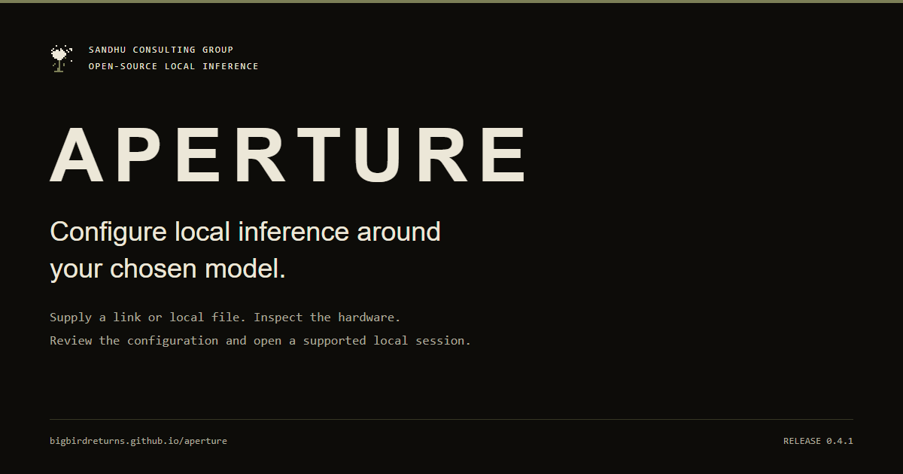

# Aperture

[](https://bigbirdreturns.github.io/aperture/)

Aperture inspects your hardware with permission, reads the model link or local files you choose, and explains a memory-aware configuration. For compatible GGUF models, it can start a local chat or bounded experiment using an existing inference runtime, including CPU/GPU split execution when the checkpoint exceeds available VRAM.

**[Website](https://bigbirdreturns.github.io/aperture/)** · **[Get started](https://bigbirdreturns.github.io/aperture/quickstart.html)** · **[Verified support](https://bigbirdreturns.github.io/aperture/support.html)** · **[Release 0.4.3](https://github.com/BigBirdReturns/aperture/releases/tag/v0.4.3)** · [MIT license](LICENSE)

## Start with one command

Install [Node.js LTS](https://nodejs.org/en/download) first. Requires Node.js 20.11 or newer; Node 22 and 24 have release control coverage. The package command does not require Git, an npm account, or a cloud-model subscription.

**Windows PowerShell**

```powershell
npx.cmd --yes --package=https://github.com/BigBirdReturns/aperture/releases/download/v0.4.3/bigbirdreturns-aperture-0.4.3.tgz aperture
```

**Linux / macOS terminal**

```sh
npx --yes --package=https://github.com/BigBirdReturns/aperture/releases/download/v0.4.3/bigbirdreturns-aperture-0.4.3.tgz aperture
```

Windows and Linux have recorded native runs; native Mac inference remains unverified. With Git installed, use `npx --yes github:BigBirdReturns/aperture#v0.4.3` instead. Distribution is through GitHub, not the npm registry namespace.

## The workflow

Approve the read-only scan, paste your model link or drag in a local file, and choose the exact representation when prompted. Review the configuration, then start a local chat, save it for later, generate one answer, or opt into an experiment. Metadata access, weight downloads, native-runtime installation, and execution have separate permissions.

Use `/new` for a fresh chat and `/exit` to release the model. Saved configurations are listed with `aperture list` and reopened with `aperture chat ANSWER.json`; retain the `npx --package=… aperture` prefix when the executable is not installed globally.

> ### Native fit before acquisition

Before asking to acquire remote GGUF weights, Aperture obtains permission for the pinned runtime and assesses the complete selected tensor tables. Bounded prefixes are capped at 8 MiB per shard and 64 MiB total. A failed or unavailable assessment stops acquisition with the model, quantization, context, sequence count, and explicit device/layer requirements unchanged. Automatic placement checks layer counts for the highest estimated fitting count, not optimal speed.

After download and complete integrity hashing, generation and chat repeat the assessment against refreshed hardware immediately before loading. Each experiment trial rehashes and reassesses independently. A later refusal preserves earlier trial results. Native memory checks and actual GPU-layer/context readback remain enabled. Shared RAM and independent GPUs are not pooled.

These are pinned-runtime estimates, not architecture or throughput guarantees. Prefixes can include initial tensor bytes but do not acquire the full checkpoint. `--answer-only` remains a lightweight provisional answer without native installation or assessment. See [VERIFICATION.md](VERIFICATION.md) for native observations and retained limits.

## What is available

Local GGUF files and complete shard sets, extensionless GGUF blobs, Hugging Face repository/file links, and direct HTTPS GGUF files are supported for inspection. Safetensors inspection and a Python/Accelerate compatibility route are also present, with separate runtime prerequisites. Model architecture support depends on the pinned runtime.

The managed GGUF path selects one compatible CUDA or Vulkan device, Apple Metal, or CPU. It preserves your selected artifact and explicit context. Independent devices and shared RAM are not pooled into fictitious capacity. NPU inventory is not NPU inference. The guided runner supports one sequence; automatic external-harness connections and distributed execution are not implemented.

## Documentation

| Start here | Continue here |
| --- | --- |
| [Installation and first session](docs/pages/quickstart.md) | [Model links, files, shards, and access](docs/pages/models.md) |
| [Memory and CPU/GPU placement](docs/pages/memory.md) | [Complete command reference](docs/pages/reference.md) |
| [Troubleshooting and recovery](docs/pages/troubleshooting.md) | [Privacy, storage, and experiments](docs/pages/privacy.md) |
| [Supported paths and native observations](docs/pages/support.md) | [Release history and pending work](docs/pages/releases.md) |

## Verification

[VERIFICATION.md](VERIFICATION.md) records native runs separately from source/control tests. The reported 4060 split exceeds **available** VRAM, not its nominal physical capacity. A successful beyond-physical-capacity run is not yet established. The earlier 0.4.1 record also includes actual RTX 3090 CUDA generation and two-turn continuity after the installed-library discovery correction.

```sh
npm test
node scripts/package-smoke.mjs
```

No telemetry or automatic result upload is enabled. Local run records can contain prompts, output, paths, and hardware identifiers; redact them before sharing. See [CONTRIBUTING.md](CONTRIBUTING.md) and [SECURITY.md](SECURITY.md) for reporting and development.

## Credits and licenses

Aperture is an independent MIT-licensed controller. [Magnitude](https://github.com/magnitudedev/magnitude) inspired the scan/select/setup experience. [node-llama-cpp](https://node-llama-cpp.withcat.ai/), [llama.cpp](https://github.com/ggml-org/llama.cpp), and [Hugging Face Accelerate](https://huggingface.co/docs/accelerate/usage_guides/big_modeling) provide distinct runtime capabilities under their own licenses. Model checkpoints keep their publishers' license and access conditions. No model weights are included here.
